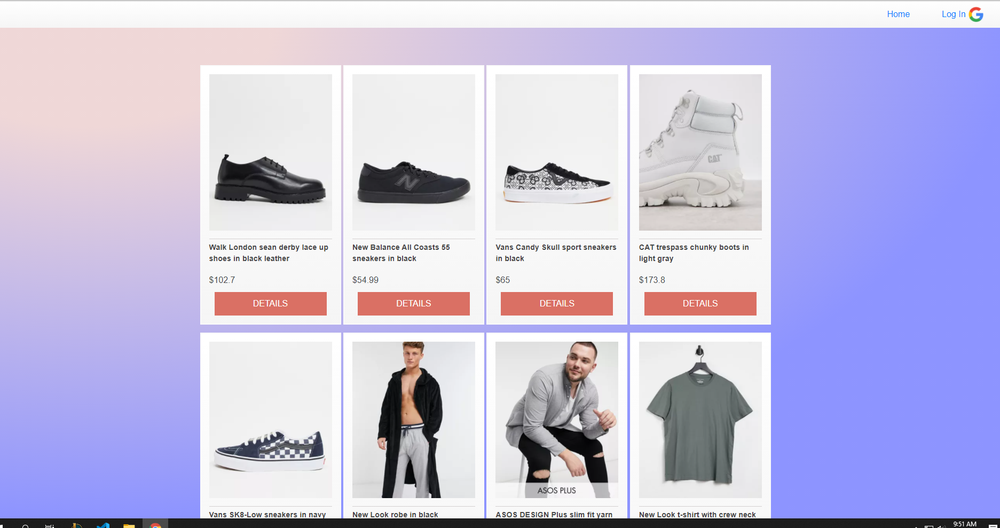
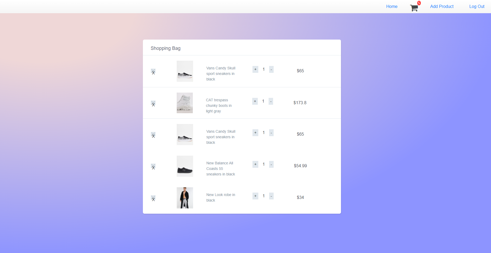

# Shopping-Site
This is a shopping site, where you can buy clothes, shoes, hats etc

## Screenshot

| | | |
|:-------------------------:|:-------------------------:|:-------------------------:|
|  blah |  ||


<!--  -->

### Installation
You can go to the shop [here](https://clothes-shoppin.herokuapp.com/products)

or clone it:
```sh
$ git clone https://github.com/sabona10/Shopping-Site.git
$ cd Shopping-Site
$ npm install
$ npm install nodemon
$ nodemon
```

and it will be at localhost:3000

### Tech

This site is created using:

* HTML - For the layout of the page!
* JS - Pure Javascript, no jQuery
* CSS - bootstrap.css, font-awesome
* Expressjs - for the framework
* APIs - Mongoose database, Google users, Heroku

### Next Steps

 - Add in the functionality where user can checkout
 - Fix some bugs creating duplicates in db
 - Add a checkout page
 - have clothes api to show clothes from different stores
 - Make css more consistent
 - fix reviews